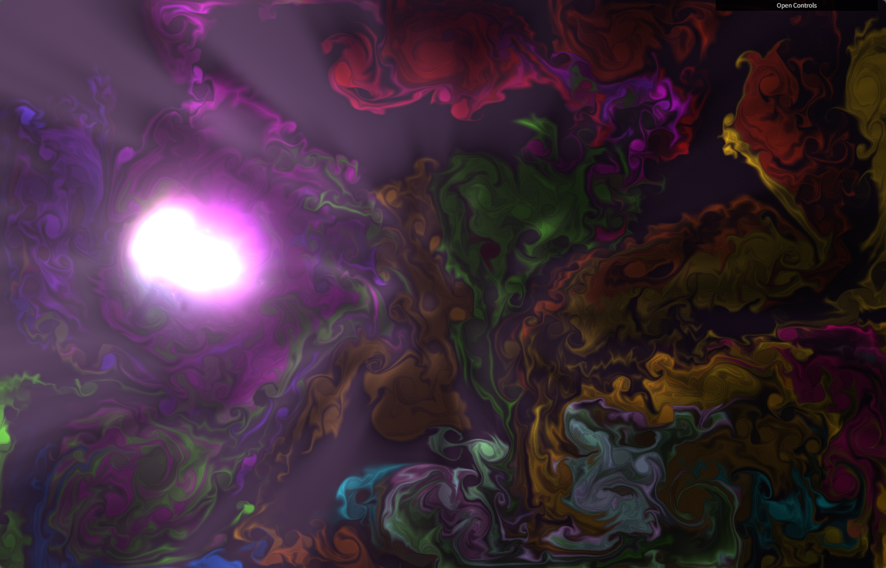
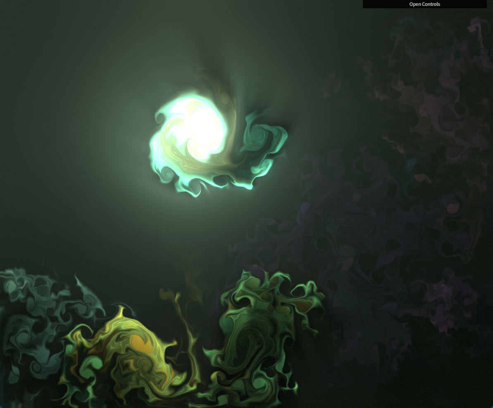
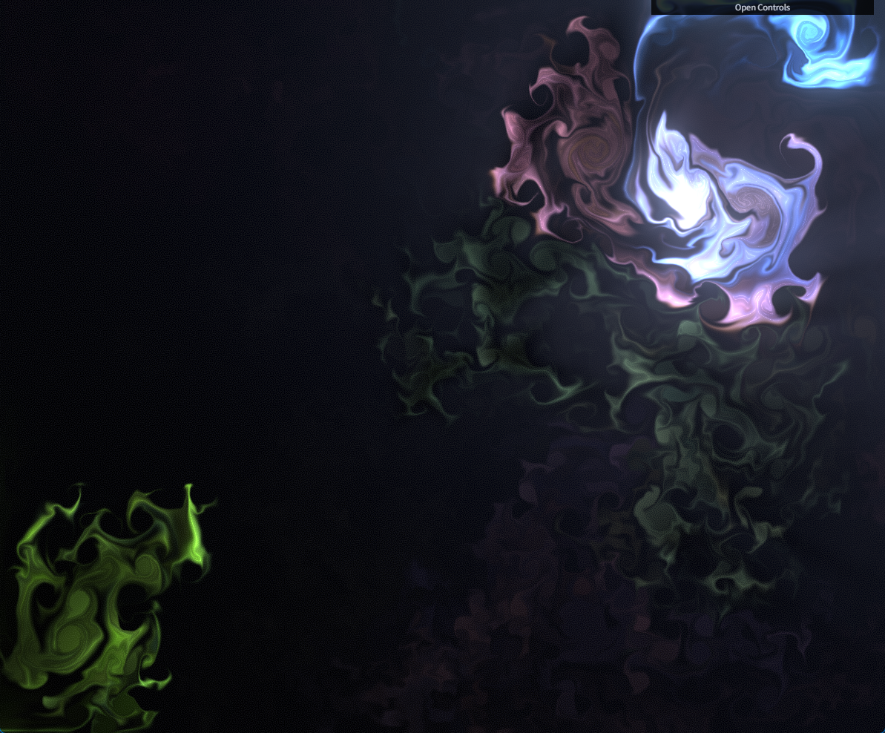

# WebGL Fluid Simulation

Raw creator URL: <https://paveldogreat.github.io/WebGL-Fluid-Simulation/>

PS. The ray effect is so adorable.

## Develop

Now it splat every $x$ seconds with random position, direction and color.

